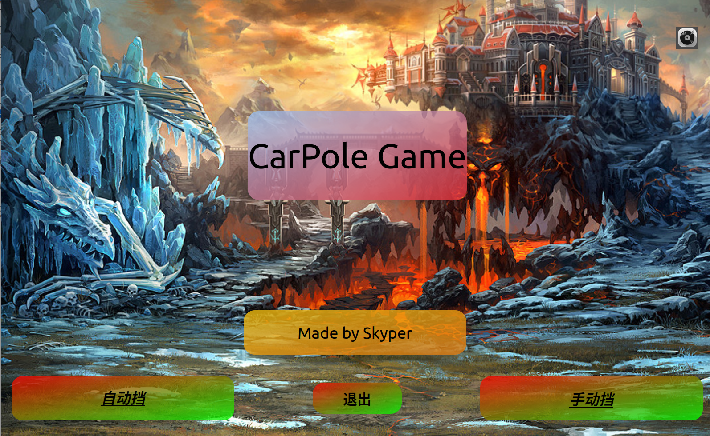

# 用途

Cartpole游戏通关，以强化学习方式实现

# 使用方法

（linux）先用conda安装环境，使用以下命令
```
conda env create -f environment.yml
conda activate envname
```
或者在python3.9之下安装pyqt5,torch==1.12.0即可

之后在终端输入
```
python CartPole.py
```
以运行游戏，支持手动和自动两种模式，自动模式在1000个step后自动结束

右上角有个音乐图标，点击可以关闭音乐

建议在linux下游玩，windows未测试
### 注意
先用 train_nn.py 训练神经网络，之后再运行 CartPole.py 以开始游玩，否则无法使用自动档


### 界面展示

